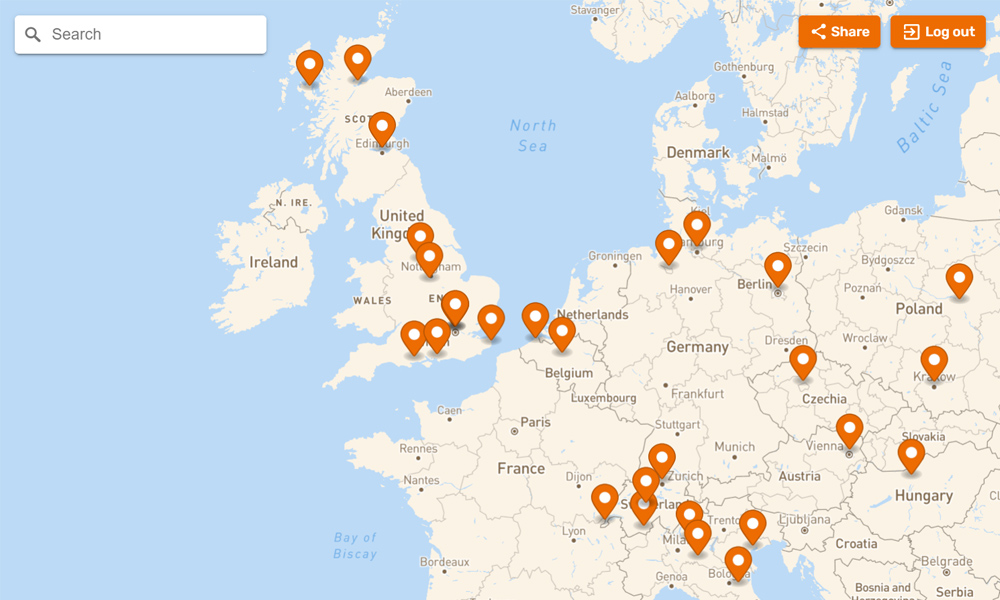

# Pin My Map - backend

Pin My Map offers users the ability to record places they have visited using the Mapbox API. Users can pin locations on the world map, add notes and photos, as well as share their personalised map page on social networks. It is built using React with Material UI and Styled Components, and powered by a Strapi back-end coupled with a PostgreSQL database.

Live site: [https://pinmymap.netlify.app](https://pinmymap.netlify.app)

Strapi backend: [https://strapi-pin-my-map.up.railway.app](https://strapi-pin-my-map.up.railway.app)

## Stack

## Key Features

- Personalised map
- Add locations with description, time stamp and upload images
- Share your personalised map on social media
- User account registration
- Detailed world map with location search
